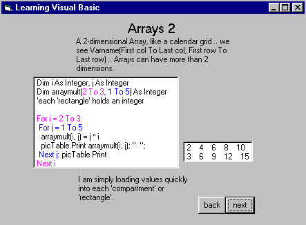



## learnvb01a

### Description

a tutorial written in vb, about vb statements, functions, built-in functions, variable types, decisions, simple graphics .. an excellent beginner's reference
 
### More Info
 

             |
---                |---
**Submitted On**   |2001-08-12 16:45:02
**By**             |[easfw](https://github.com/Planet-Source-Code/PSCIndex/blob/master/ByAuthor/easfw.md)
**Level**          |Beginner
**User Rating**    |5.0 (10 globes from 2 users)
**Compatibility**  |VB 6\.0
**Category**       |[Miscellaneous](https://github.com/Planet-Source-Code/PSCIndex/blob/master/ByCategory/miscellaneous__1-1.md)
**World**          |[Visual Basic](https://github.com/Planet-Source-Code/PSCIndex/blob/master/ByWorld/visual-basic.md)
**Archive File**   |[learnvb01a245358122001\.zip](https://github.com/Planet-Source-Code/easfw-learnvb01a__1-26049/archive/master.zip)

